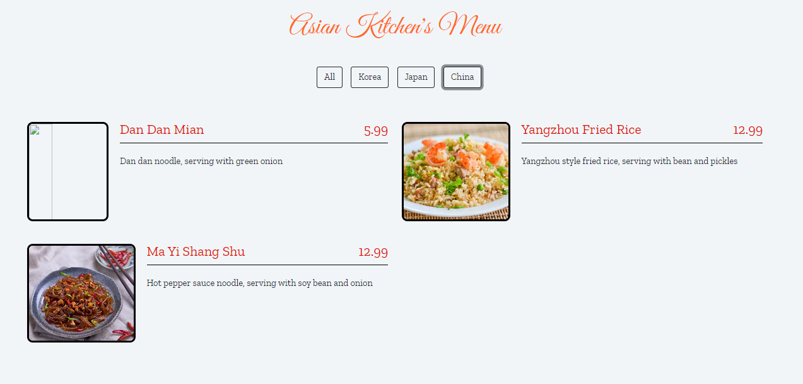

Proje [Patika.dev](https://academy.patika.dev/) React Native Patikası' nın JavaScript Eğitimi' nin Nesneler konusunun ödevi olarak yapılmıştır.

Proje asya mutfağına ait yemekler ve özelliklerinin bir menü şeklinde gösterimini içerir. Üst kısımda ülke filtrelesi bulunur ve seçilen ülkeye ait yemekler menü ekranında listelenir.

Projenin Html ve Css dosyaları Patika.dev tarafından sağlanmış JavaScript kodları tarafımca yazılmıştır.

